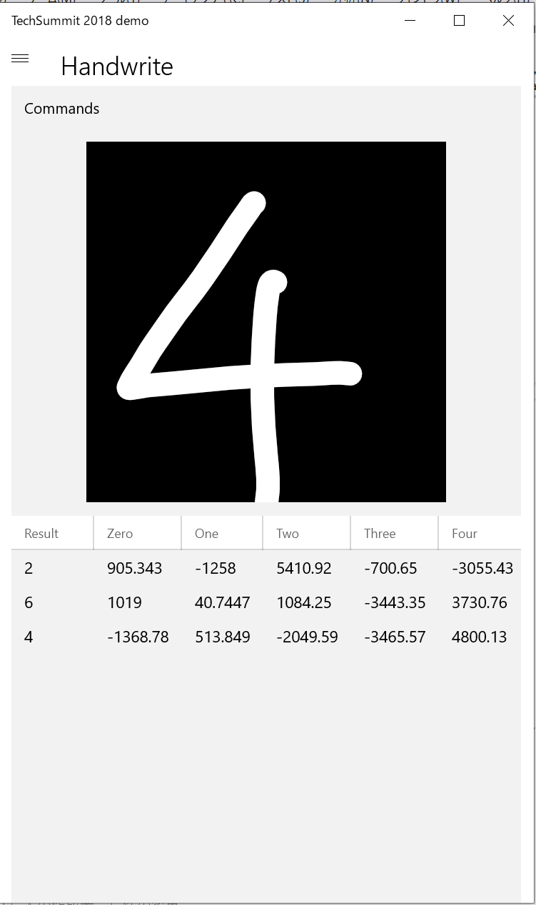
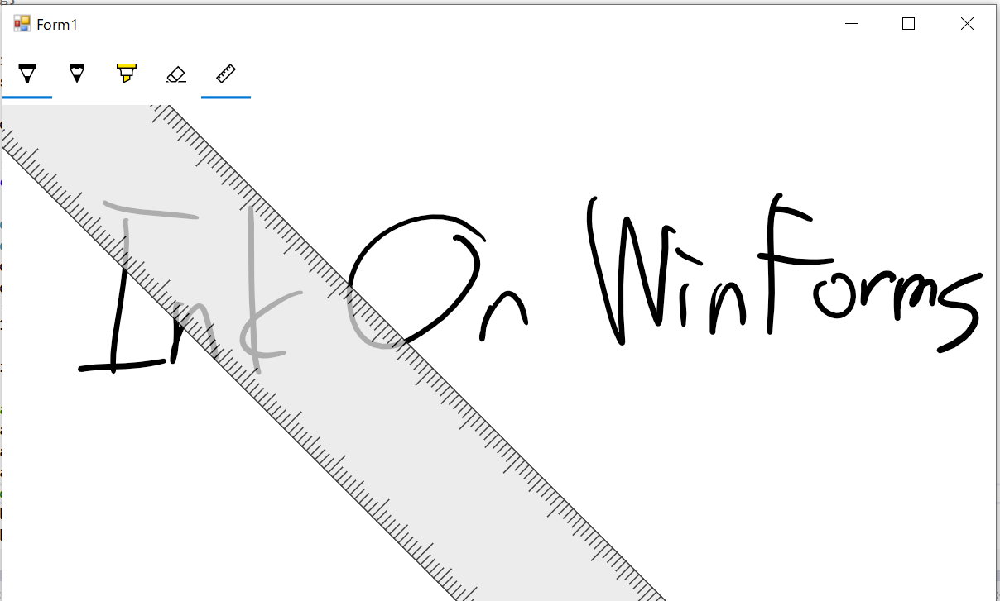

# このリポジトリについて

Microsoft Tech Summit 2018 Japan の AC04 Windows 10 対応のデスクトップアプリを作る技術のために準備したコードをそのまま上げています。

# 開くべきソリューションファイル

`TechSummit2018/TechSummit2018.sln` を開いてください。

# プロジェクトの説明

## AI/HandwriteApp

mnist.onnx を使用した手書きの数字の認識プログラムです。

`Views/MainPage.xaml` で文字を書く領域の InkCanvas と認識結果の履歴を表示する DataGrid を置いたりしています。

`Views/MainPage.xaml.cs` で一筆ごとに認識処理を呼んだりしています。

`ViewModels/MainPageViewModel.cs` で mnist.onnx を読み込んで自動生成されたコードを使って認識処理をしています。



## CrossDevice フォルダ

失敗したデモのプロジェクトになります。

`CrossDeviceSample` が Windows アプリケーション パッケージ プロジェクト になります。`CrossDeviceSample.WPF` をパッケージングするためのプロジェクトです。
Package.appxmanifest ファイルで `crossdevicesample:` で起動するように定義を追加しています。

`CrossDeviceSample.UWP` プロジェクトが Microsoft Graph API と通信するための仲介役となる AppService をホストするためのプロジェクトです。
AppService 自体は `CrossDeviceSample.AppService` プロジェクトの `CommunicationService.cs` で定義しています。

### 動かし方

まず、`CrossDeviceSample` プロジェクトを実行します。
Visual Studio の出力ウィンドウにランダムな文字列のパッケージファミリーネームが出力されるので保存します。
次に、`CrossDeviceSample.UWP` を実行して同じように表示されるパッケージファミリーネームを保存します。

`CrossDeviceSample` を実行したときに表示されたパッケージファミリーネームを `CrossDeviceSample.AppService` プロジェクトの `CommunicationService.cs` にある `ClientFamilyName` の値に設定します。また、`CrossDeviceSample.WPF` プロジェクトの `Consts.cs` にある `CommunicationServiceHost` の値を `CrossDeviceSample.UWP` で表示されたパッケージファミリーネームにします。

再度、両方のプロジェクトを実行してインストールされている状態にします。

[Microsoft Graph Explorer](https://developer.microsoft.com/ja-jp/graph/graph-explorer) のページを開きます。
`Sign in with Microsoft` で、パソコンに紐づいているマイクロソフトアカウントでサインインします。`アクセス許可の修正` リンクをクリックして以下の 2 つのアクセス許可にチェックを入れて再度サインインします。

- Device.Command
- Device.Read

以下のエンドポイントを Microsoft Graph Explorer から `GET` でクエリを実行します。

- https://graph.microsoft.com/beta/me/devices

応答のプレビューにデバイスのリストの JSON が表示されるので、そのなかから Name が今作業をしている PC のものに該当するものを探して id の値を控えておきます。

次に、以下の URL に対して `POST` でクエリを実行します。

- https://graph.microsoft.com/beta/me/devices/<ここに先ほど取得したデバイスの ID を入れる>/commands

```json
{
  "type": "LaunchUri",
  "payload": {
    "uri": "crossdevicesample:?message=HelloWorld"
  }
}
```

アプリが立ち上がり payload の uri の message パラメーターに指定した値（今回の場合は HelloWorld) が表示されます。


message パラメーターにスペースがあったり日本語がある場合には、このプログラムでは対応していません。

アプリの右下に Success と表示されていることを確認します。これが Success となっていない場合は `Consts.cs` に指定するパッケージファミリーネームを間違えているか、`CrossDeviceSample.UWP` プロジェクトが正しくインストールされていない可能性があります。


続けて、Microsoft Graph Explorer から同じ URL に対して `POST` で以下の JSON を要求本文に設定してクエリを実行します。

```json
{
  "type": "appService",
  "payload": {
    "message": "こんにちは"
  },
  "packageFamilyName": "<CrossDeviceSample.UWP のパッケージファミリーネームをここに設定>",
  "appServiceName": "CommunicationService"
}
```


複数個アプリを立ち上げてても OK です。`CommunicationService` では接続してきている `CrossDeviceSample` に対して受け取ったメッセージをブロードキャストしています。

以下のリンクから動作の動画を参照できます。

https://youtu.be/YBm3oU8C6YM

## DesktopBridge フォルダ

C++/WinRT を使って MFC アプリから Windows Runtime API を叩くサンプルです。

- WinRTMFCApp プロジェクト
    - MFC のプロジェクトです。そのまま実行してヘルプの「WinRTMFCAppについて」をクリックするとダイアログが表示されます。UWPFeatures プロジェクトの dll を exe と一緒にパッケージングしています。
- WinRTMFCApp.UWP プロジェクト
    - WinRTMFCApp をパッケージングする Windows アプリケーション パッケージ プロジェクトです。実行してヘルプの「WinRTMFCAppについて」をクリックするとトースト通知が表示されます。WinRTMFCApp.cpp の `OnAppAbout` メソッドでは `LoadLibrary` をして UWP の機能がラップされた `UWPFeatures.dll` の有無で処理を呼び分けています。
- UWPFeatures プロジェクト
    - Windows Runtime API のトースト通知を表示される機能をラップした DLL です。


## MSIX フォルダ

LauncherApp を msix に MSIX Packaging Tool でパッケージングして、CompanyA.SubApp と CompanyB.SubApp を変更パッケージとしてパッケージングすることで動作します。
詳細は以下のブログ記事を確認してください。

[もうすぐリリースされる（はずの） MSIX の Modification Package を試してみよう](https://blog.okazuki.jp/entry/2018/09/27/182936)

## XamlIsland フォルダ

Windows Forms 向けの WindowsXamlHost を使用しています。
`Form1.cs` のコンストラクタで WindowsXamlHost を使用しています。（デザイナーでの配置を行うと 2018/11/08 時点では Visual Studio がクラッシュする know issue があるためコードで組み立てています。）



# 発表スライド

以下の SlideShare にセッション時点のものをアップロードしています。

[Windows 10 に対応したデスクトップ アプリを作る技術](https://www.slideshare.net/okazuki0130/windows-10-v2)

配布用のスライドについては変更はない予定ですが、正式な TechSummit 2018 のサイトから配布されるものをご利用ください。

# セッション動画

セッション動画も TechSummit 2018 のサイトから公開される予定です。

[Tech Summit 2018](https://www.microsoft.com/ja-jp/events/techsummit/2018/)
